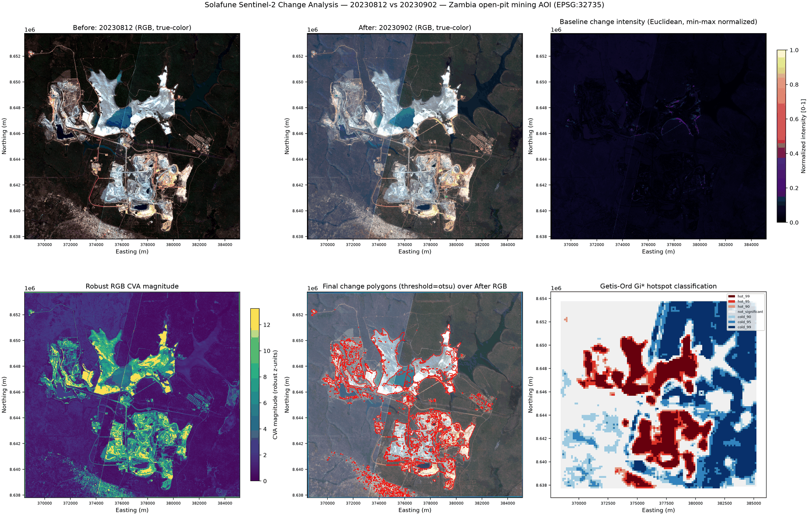

# Solafune Sentinel-2 Change Analysis

Reproducible Sentinel-2 change-detection pipeline for a Solafune technical
assessment, built as a real analytics product rather than a notebook: a
typed, tested Python package (`solafune_change`), a CLI, a spatial database,
static/interactive visualization, spatial statistics (Moran's I / Getis-Ord
Gi*), an experimental unsupervised spatial-ML layer, and an installable QGIS
plugin — all sharing one core analysis engine.

**AOI**: an open-pit mining site in Zambia, ~264.6 km². **Dates**: 2023-08-12
vs 2023-09-02. **Bands**: B02/B03/B04 only (no NDVI — see Limitations).

> **Reviewing this submission?** Everything meant for review — the QGIS
> plugin install package, the runnable script/CLI edition (a full source
> snapshot), a copy of the raw input data, the actual output artifacts from
> a real run, and a detailed usage guide (`Usage_Guide.pdf`) — is bundled in
> the [`submission/`](submission/) folder. Start with
> [`submission/README.md`](submission/README.md).

## What was built

- `src/solafune_change/` — the core engine (config, discovery, validation,
  preprocessing, baseline, robust CVA, thresholding, postprocessing,
  vectorization, spatial statistics, experimental spatial ML, database,
  visualization, reporting, pipeline orchestration, CLI).
- `qgis_plugin/solafune_change_analyzer/` — an installable QGIS plugin (dock
  widget, background execution, Processing Toolbox algorithm) that calls the
  *same* engine — no analysis logic is duplicated.
- `tests/` — 60 pytest tests (unit + a real-data integration test), all passing.
- `outputs/` — generated by running the pipeline (GeoPackage, figures, maps,
  statistics, manifests) — see "Where results go" below.

## Quick start

```bash
python -m venv .venv
.venv\Scripts\pip install -r requirements-dev.txt   # or requirements.txt for a leaner install
.venv\Scripts\pip install -e .

solafune-change all --config config/default.yaml
```

This runs the entire pipeline (stack -> baseline + robust CVA -> threshold ->
polygonize -> spatial statistics -> GeoPackage -> figures/interactive map ->
`report.md`) against the provided `inputs/` data in one command, in ~30
seconds on the reference machine.

**Results land in**: `outputs/` (database, figures, maps, statistics,
`summary.json`, `run_manifest.json`, `quality_report.json`, `report.md`) and
`data/processed/` (the stacked/intermediate GeoTIFFs).

**QGIS plugin**: `python scripts/build_qgis_plugin.py`, then in QGIS:
Plugins > Manage and Install Plugins > Install from ZIP > select
`outputs/qgis/solafune_change_analyzer.zip`. See "QGIS Plugin" below.

## Key result



*Real output from the reference run (`config/default.yaml`, seed=42): the
open-pit mine and waste-rock areas visible in both dates are the dominant
source of spectral change; the robust CVA magnitude and the Gi* hotspot
classification independently converge on the same two clusters (the
northwest and southeast pit complexes).*

## Key features

- **Two independent change-detection methods**, compared, not just one:
  a from-scratch reimplementation of the assignment's example algorithm
  (`baseline.py`) and a robust multivariate Change Vector Analysis
  (`cva.py`) that standardizes per-band differences with median/MAD before
  combining them — deliberately more resistant to the single-extreme-pixel
  problem that limits the baseline.
- **Real spatial statistics, not just pixel differencing**: Global Moran's I,
  Local Moran's I (LISA), and Getis-Ord Gi* with Benjamini-Hochberg FDR
  correction, computed on a regular analysis grid (never a dense per-pixel
  weights matrix).
- **Experimental, opt-in unsupervised spatial ML** (Isolation Forest /
  DBSCAN) with spatial block-bootstrap stability diagnostics instead of a
  fabricated accuracy score — there is no ground truth for this AOI, and the
  code never claims there is.
- **A real spatial database**: GeoPackage (SQLite + OGC geometry columns),
  not WKT-in-a-text-column, with `run_metadata` and `quality_checks` tables
  alongside `change_features`/`spatial_grid`.
- **One core engine, two front ends**: the CLI and the QGIS plugin both call
  `solafune_change.pipeline.run_pipeline()` — verified by an actual QGIS
  3.44.12 smoke test (see `docs/QGIS_PLUGIN_TEST_CHECKLIST.md`).
- **Honest, bounded claims throughout**: `confidence` is a documented
  heuristic (not a probability), Gi*/Moran's p-values describe spatial
  pattern (not land-use cause), and every limitation below is also stated in
  `report.md`.

## Workflow

```mermaid
flowchart TD
    A[inputs/: B02/B03/B04 x2 dates + AOI] --> B[discovery + validation<br/>CRS, transform, dims, AOI overlap]
    B --> C[preprocessing<br/>align to reference grid, AOI mask, stack GeoTIFFs]
    C --> D1[baseline.py<br/>Euclidean distance, min-max norm]
    C --> D2[preprocessing.apply_normalization<br/>robust median/MAD]
    D2 --> D3[cva.py<br/>robust per-band z-score CVA]
    D1 --> E[thresholding<br/>Otsu / percentile / manual]
    D3 --> E
    E --> F[postprocessing<br/>morphology + min-area filter]
    F --> G[vectorization<br/>polygonize, area/perimeter, confidence]
    G --> H[spatial_statistics<br/>grid, Global/Local Moran's I, Gi*, FDR]
    H --> I[spatial_ml (opt-in)<br/>Isolation Forest / DBSCAN + stability]
    H --> J[database.py<br/>GeoPackage: features, grid, run_metadata, quality_checks]
    I --> J
    J --> K[visualization.py<br/>static PNG + interactive HTML + QML styles]
    J --> L[reporting.py<br/>summary.json, run_manifest.json, report.md]
```

## Repository structure

```
solafune-sentinel2-change/
├── inputs/                       original assignment data (never modified)
├── src/solafune_change/          core engine (framework-independent)
├── qgis_plugin/                  installable QGIS plugin
├── config/default.yaml           single YAML config, shared by CLI + plugin
├── tests/                        pytest suite (unit + real-data integration)
├── docs/                         QGIS plugin docs, example SQL, key images
├── scripts/                      build_qgis_plugin.py, validate_qgis_plugin.py
├── data/processed/                generated: stacked + intermediate GeoTIFFs
├── outputs/                      generated: database, figures, maps, reports
├── pyproject.toml / requirements*.txt
├── Makefile
├── report.md                     analysis report (real numbers, see below)
└── README.md
```

## Environment setup

Requires Python >= 3.10. Tested with Python 3.12 on Windows.

```bash
python -m venv .venv
.venv\Scripts\pip install --upgrade pip
.venv\Scripts\pip install -r requirements-dev.txt   # dev: adds pytest/ruff/black/mypy
.venv\Scripts\pip install -e .
```

(macOS/Linux: `source .venv/bin/activate` instead of `.venv\Scripts\...`.)

Core dependencies: numpy, pandas, rasterio, geopandas, shapely, pyproj,
scipy, scikit-image, scikit-learn, libpysal, esda, pyogrio, matplotlib,
folium, PyYAML, typer, rich. Versions are floor-pinned (`>=`), not exact, in
`requirements.txt` — see that file for the full list.

## One-command run

```bash
solafune-change all --config config/default.yaml
# or: python -m solafune_change all --config config/default.yaml
```

## CLI usage

```
solafune-change validate --config config/default.yaml     # dry-run: checks only
solafune-change run --config config/default.yaml           # full pipeline
solafune-change stats --config config/default.yaml         # full pipeline, spatial stats forced on
solafune-change visualize --config config/default.yaml     # full pipeline (viz is always part of a run)
solafune-change report --config config/default.yaml        # full pipeline, emphasizes report.md
solafune-change all --config config/default.yaml           # validate -> run in one command (recommended)
```

Every option in `config/default.yaml` can be overridden on the command line,
e.g.:

```bash
solafune-change run --config config/default.yaml \
  --threshold-method percentile --percentile 97 \
  --min-area-m2 900 --grid-size-m 200 --permutations 499 \
  --seed 7 --ml --verbose
```

Other useful flags: `--before`/`--after`/`--aoi`/`--output-dir` (path
overrides), `--method baseline|cva|both`, `--no-ml` (force ML off),
`--json-progress` (machine-readable JSON Lines progress, used by the QGIS
plugin's external-process mode).

## QGIS Plugin

### Install from ZIP
```bash
python scripts/build_qgis_plugin.py
```
1. Open QGIS (3.28+; developed/tested against 3.44.12)
2. Plugins > Manage and Install Plugins > Install from ZIP
3. Select `outputs/qgis/solafune_change_analyzer.zip`
4. Open Plugins > Solafune Change Analyzer

### Run
1. Select before/after Sentinel-2 folders and an AOI file
2. Click **Validate Inputs**
3. Configure detection + spatial analysis (Change Detection / Spatial
   Analysis tabs)
4. Check the **Dependencies** tab — most Windows/OSGeo4W QGIS installs are
   missing `rasterio`/`scikit-learn`/`libpysal`/etc.; point "External
   interpreter" at this project's `.venv` if so (verified: this was actually
   the case on the QGIS 3.44.12 install used to test this plugin — see
   `docs/QGIS_PLUGIN_ARCHITECTURE.md`)
5. Click **Run Analysis** on the Run & Results tab
6. Review the auto-loaded, auto-styled layers and the GeoPackage

Full details: `docs/QGIS_PLUGIN_USER_GUIDE.md` (usage),
`docs/QGIS_PLUGIN_DEVELOPMENT.md` (build/dev),
`docs/QGIS_PLUGIN_ARCHITECTURE.md` (design),
`docs/QGIS_PLUGIN_TEST_CHECKLIST.md` (what was actually verified, on real QGIS).

The Processing Toolbox also exposes the same engine under **Solafune
Geospatial Analytics > Sentinel-2 Change Analysis**.

## Data preparation

`solafune_change.discovery.discover_bands()` locates B02/B03/B04 by filename
pattern (`B0[2348]`/`B8A` token, case-insensitive) in GeoTIFF or JP2 files —
no hardcoded paths — and raises a clear error on a missing or duplicate
band. `validation.py` then checks CRS/transform/dimensions consistency
within and across dates, and AOI/imagery overlap, before any analysis runs.

The two provided dates happen to already share an identical grid (verified:
same CRS, transform, 1673x1597 px). The alignment code path is still fully
implemented and tested (`tests/test_preprocessing.py::test_build_aligned_inputs_triggers_resample_on_grid_mismatch`)
for the general case: if the two dates are on different grids, the "after"
date is reprojected/resampled (bilinear) onto the "before" date's reference
grid.

## Baseline method

`baseline.py` independently reimplements the idea in the provided
`example_change_detection.py`: per-pixel multi-band Euclidean distance,
min-max normalized (restricted to the valid/AOI mask, not the whole raster
including NoData corners). It intentionally carries the example's key
weakness forward unmitigated, and documents it: no radiometric
normalization, and a single extreme pixel stretches the whole intensity
scale. On the reference run it flags **47.85%** of valid pixels above its
own Otsu threshold — visibly noisier than CVA (see the figure above).

## Robust RGB CVA (primary method)

`cva.py` computes, per band, `z_b = (diff_b - median(diff_b)) / (1.4826 *
MAD(diff_b))` over the common valid mask, then `CVA = sqrt(sum(z_b^2))`.
Median/MAD instead of mean/std keeps outlier pixels from distorting the
scale for every other pixel. If a band's MAD collapses to ~0, the code falls
back to the (regular) standard deviation and logs it (`mad_near_zero_fallback`
in the run log/report) rather than dividing by ~0.

### Radiometric normalization

Applied to the "after" date before CVA (`preprocessing.py`), default
`robust_median_mad`: band-wise median/MAD linear match using only pixels
valid in both dates and inside the AOI. Percentile matching and a
pseudo-invariant-feature (PIF) linear method are also implemented and
selectable. **Limitation**: none of these distinguish true reflectance
change from residual atmospheric/illumination differences; they only reduce
(not eliminate) whole-scene brightness shift as a confound.

### Reflectance scale assumption

The provided bands are scaled uint16 DNs (observed range: 0-~10,700,
median ~1,500-2,000). No product metadata/XML shipped with the assignment,
so a scale factor of 10,000 (the standard ESA L1C/L2A convention, DN/10000
-> reflectance) is assumed and applied — documented here, not silently
guessed.

## Threshold and post-processing

`otsu` (default), `percentile`, or `manual`, computed over valid pixels only
(`thresholding.py`). `postprocessing.py` then applies configurable binary
opening/closing and a minimum-area filter, converting `min_area_m2` to a
pixel-count threshold via the actual pixel area (10m x 10m here) — not a
hardcoded pixel count. Default: Otsu threshold, opening-then-closing with a
3px kernel, 400 m^2 minimum area (4 px).

## Spatial statistics

Pixel rasters are aggregated onto a regular analysis grid (default 150 m,
configurable — never a dense per-pixel weights matrix) before any spatial
weights are built (`spatial_statistics.py`). On the reference run: 11,967
grid cells.

- **Global Moran's I**: Queen contiguity (row-standardized), 999
  permutations, seed 42. Reference-run result: **I = 0.8335, permutation
  p = 0.001** — strong positive spatial autocorrelation (changed pixels
  cluster spatially; this is not evidence of a specific cause).
- **Local Moran's I (LISA)**: HH/LL/HL/LH cluster labels per cell, using the
  permutation p-value at alpha=0.05.
- **Getis-Ord Gi\***: binary weights (per the conventional Gi* definition,
  distinct from Moran's row-standardized weights), 90/95/99% hot/cold
  classes. Benjamini-Hochberg FDR-corrected q-values are stored alongside
  the raw p-values (`gi_pvalue` vs `gi_qvalue`) — multiple local
  significance tests otherwise overstate how many "significant" hotspots
  there really are.

## Unsupervised spatial ML (experimental, opt-in)

Disabled by default (`spatial_ml.enabled: false` in `config/default.yaml`,
`--ml` to enable). Isolation Forest (default) or DBSCAN over the same
analysis grid, robust-scaled features (mean/median/p95 CVA, changed-pixel
proportion, per-band mean diffs, local texture). No ground-truth labels
exist for this AOI, so **no accuracy/precision/recall is computed anywhere**
— instead, stability is assessed via spatial block bootstrap (does the
top-K anomaly set survive resampling by spatial block?) and hyperparameter
perturbation. Example result (Isolation Forest, `--ml`, otherwise default
config): top-K anomaly overlap under spatial block bootstrap = **0.72** —
reported as a stability diagnostic, not a validation score.

## Spatial database

`outputs/database/change_analysis.gpkg` — an OGC **GeoPackage**, which is
itself a plain **SQLite** database with standardized geometry columns and
spatial indexes (no server process needed). Tables/layers:

| Name | Contents |
|---|---|
| `change_features` | polygons: id, dates, method, threshold, area/perimeter/compactness, mean/max/p95 change, `confidence`, Gi*/LISA attributes, ML anomaly score/cluster (real geometry column, not WKT text) |
| `spatial_grid` | the analysis grid with all per-cell statistics (real geometry column) |
| `run_metadata` | run id/timestamp, input paths + checksums, CRS/resolution, parameters, package version, seed, output paths |
| `quality_checks` | validation issues/warnings recorded for that run |

Sample queries (all verified to run against the real reference-run
database): `docs/example_queries.sql`.

## Output files

```
data/processed/
  sentinel2_20230812_stack.tif, sentinel2_20230902_stack.tif   RGB-order stacks
  baseline_change_intensity.tif, baseline_change_binary.tif
  cva_change_intensity.tif, cva_change_binary.tif
outputs/
  database/change_analysis.gpkg
  figures/change_comparison.png
  maps/interactive_map.html, maps/spatial_statistics.gpkg
  statistics/global_moran.json, statistics/spatial_statistics.csv
  qgis/styles/*.qml, qgis/solafune_change_analyzer.zip (+ .sha256)
  summary.json, run_manifest.json, quality_report.json, report.md
```

## Reproducibility

Every stochastic step (permutation inference, Isolation Forest, DBSCAN)
takes an explicit `random_seed` (default 42, set in `config/default.yaml`
and overridable via `--seed`). `tests/test_pipeline_integration.py::test_run_pipeline_is_reproducible_with_fixed_seed`
verifies bit-identical summary output across two independent runs with the
same seed. `run_manifest.json` records the seed, input checksums, package
versions, and every parameter used.

## Tests

```bash
python -m pytest tests/ -v
```

60 tests, all passing: band discovery (incl. missing/duplicate bands), CRS/
grid validation, alignment/resampling, stack writing, robust CVA (incl. the
MAD-near-zero edge case), thresholding (Otsu/percentile/manual),
morphology/min-area filtering, polygonization + area calculation (incl. the
"everything filtered out" edge case), Global Moran's I / Local Moran's I /
Gi* result structure, BH-FDR monotonicity, GeoPackage geometry round-trip,
config parsing, CLI smoke tests (incl. `--json-progress`), seed
reproducibility, and QGIS-plugin structural checks (no `qgis`/`PyQt` import
in the core; no placeholder handlers; ZIP structure). A real-data
integration test (`tests/test_integration_real_data.py`) runs the full
pipeline against the actual `inputs/` data and is skipped automatically if
that data isn't present.

Quality tooling: `ruff check .` and `black --check ...` both pass clean (see
`pyproject.toml` for scope/config). `mypy` is configured (`[tool.mypy]` in
`pyproject.toml`) but could not actually be executed in this sandboxed
development environment (its compiled extension fails to load under this
sandbox's DLL-loading policy — an environment restriction, not a code issue);
type hints are present throughout `src/solafune_change/` regardless. Run
`mypy src/solafune_change` yourself in an unrestricted environment to verify.

`pre-commit` is configured (`.pre-commit-config.yaml`: ruff, black, and
basic hygiene hooks) and installed automatically by `make setup`; install it
manually with `pre-commit install` if you set up the environment another way.

**Two environment quirks fixed during development** (both diagnosed and
resolved, not worked around):

1. A stray system-wide `PROJ_LIB` environment variable on the development
   machine (pointing at an unrelated PostGIS install's `proj.db`) caused
   spurious GDAL/PROJ warnings and could make `rasterio.crs.CRS.from_epsg()`
   fail. Fixed by repointing `PROJ_LIB`/`PROJ_DATA` at rasterio's own
   bundled, version-matched PROJ data at import time
   (`solafune_change/__init__.py`), plus hardening `preprocessing._normalize_crs`
   to never let a PROJ lookup failure propagate as an unhandled exception.
2. Matplotlib's automatic backend selection could intermittently resolve to
   an interactive backend (TkAgg) in this headless environment and fail with
   `TclError: Can't find a usable tk.tcl`. Fixed by forcing the
   non-interactive `Agg` backend explicitly in `visualization.py` before
   `pyplot` is imported (this package never needs an interactive window).

## Key assumptions

- Stack band order is Red-Green-Blue (B04, B03, B02) — the conventional
  true-color order — not numeric B02/B03/B04 order.
- Sentinel-2 reflectance scale factor = 10,000 (DN/10000 -> reflectance);
  no product XML was provided to confirm this, see "Reflectance scale
  assumption" above.
- The first ("before") date's grid is the reference grid; the second is
  aligned to it if needed.
- Area/perimeter for change polygons are computed directly in EPSG:32735
  (the CRS the imagery is delivered in) — an appropriate projected CRS for
  this specific AOI (Zambia, UTM zone 35S), so no further reprojection is
  performed for area calculations.
- Default analysis grid cell size for spatial statistics: 150 m (a
  15x15-pixel aggregation at 10 m GSD) — configurable via
  `spatial_statistics.grid_size_m`.
- `confidence` on each change feature is a documented 0-1 heuristic
  (threshold excess + intensity consistency + patch size + Gi* significance
  + ML anomaly rank when available) — explicitly **not** a calibrated
  probability.

## Limitations

- **No NDVI**: only B02/B03/B04 were provided; NDVI requires a NIR band
  (B08), which is neither provided nor read anywhere in this codebase.
- **No cloud/shadow mask**: no Scene Classification Layer (SCL) was
  provided; cloud/shadow contamination cannot be explicitly excluded from
  detected "change".
- **Only two dates**: seasonal and other transient (non-mining) surface
  change cannot be separated from persistent change with a two-date
  comparison.
- **No ground truth**: there are no labels for this AOI. No
  accuracy/precision/recall is computed or claimed anywhere in this project
  — not for the change detection, and not for the experimental ML.
- **`confidence` is a heuristic**, not a calibrated probability (see above).
- **Gi*/Moran's I significance describes spatial pattern, not cause.**
  A statistically significant hotspot is consistent with coherent surface
  disturbance; it does not by itself confirm mining activity, excavation,
  or any specific land-use transition.
- **Radiometric normalization reduces, not eliminates**, whole-scene
  brightness/atmospheric differences as a confound.

## Result interpretation caveats

See `report.md` section 5 ("Interpretation") for the full discussion. In
short: the detected change is **spatially coherent and statistically
clustered** (strong positive Global Moran's I, large Gi* hotspot regions
aligned with the visible pit/waste-rock areas), which is consistent with
real, structured surface change rather than sensor noise — but RGB imagery
from two dates cannot on its own distinguish excavation expansion, waste-
rock deposition, haul-road changes, water/moisture variation, or vegetation
removal from each other, and cannot rule out a smaller contribution from
illumination/registration artifacts. Treat all interpretive statements here
and in `report.md` as "consistent with" / "may indicate", never as confirmed
land-use classification.
