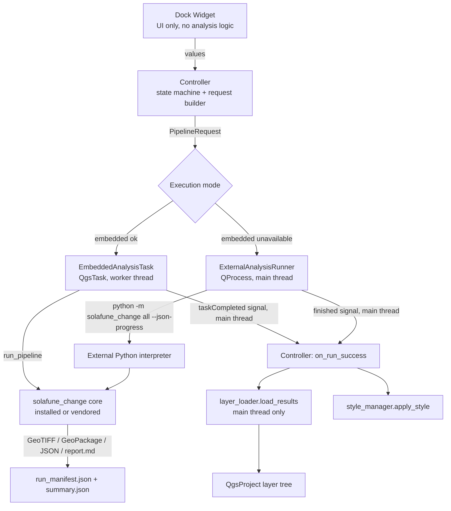
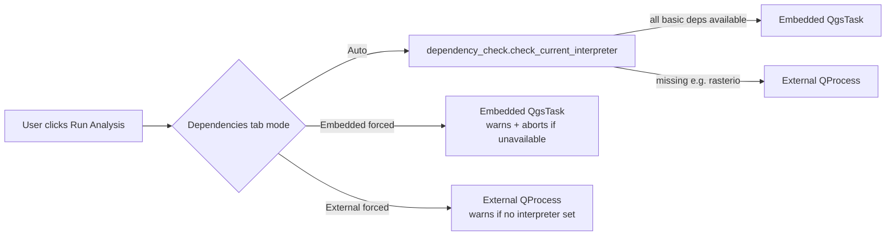

# QGIS Plugin Architecture

## Data flow

## Thread ownership

| Component | Thread | May touch QgsProject/layer tree? |
|---|---|---|
| `dock_widget.py` | main | yes (it's a widget) |
| `controller.py` | main | yes |
| `EmbeddedAnalysisTask.run()` | QgsTask worker thread | **no** — computes only, returns a `PipelineResult` |
| `EmbeddedAnalysisTask` signals (`taskCompleted`) | main (QGIS delivers task signals on the main thread) | yes |
| `ExternalAnalysisRunner` | main (QProcess is async I/O, not a separate thread) | yes |
| `layer_loader.load_results()` | main only, called from a signal handler | yes |
| `style_manager.py` | main only | yes (mutates layer renderers) |

The one rule that matters: **worker-thread code (`task.py`) never imports `qgis.core`
project/layer-tree symbols and never calls back into the dock widget directly** —
it only appends to a plain list (`progress_log`) and sets `self.result` /
`self.error_message`, which the main-thread `taskCompleted`/`taskTerminated`
handler in `controller.py` reads afterward.

## Execution mode selection

On the reference development machine (QGIS 3.44.12 on Windows/OSGeo4W), the
embedded interpreter has `numpy`/`geopandas`/`shapely`/`pyproj`/`scipy` but
**not** `rasterio`, `scikit-image`, `scikit-learn`, `libpysal`, `esda`, or
`folium` — so `embedded_mode_available()` returns `False` there and the
controller falls back to External mode automatically. This was verified by
actually running `dependency_check.check_current_interpreter()` inside that
QGIS's Python (see `docs/QGIS_PLUGIN_TEST_CHECKLIST.md`).

## Why not vendor pysal/scikit-learn/etc. too?

Only the pure-Python core package (`src/solafune_change`) is vendored into
the plugin ZIP (see "Core packaging strategy" below); its third-party
scientific dependencies are not. Vendoring compiled wheels (rasterio's GDAL
binding, scikit-learn, etc.) inside a plugin ZIP is fragile across OS/Python
ABI combinations and was judged not worth the complexity for this assessment
— External mode (pointing at a project `.venv`) is the documented, tested
path for full functionality on a stock QGIS/OSGeo4W install.

## Core packaging strategy: build-time vendor copy

`src/solafune_change` is the single source of truth. `scripts/build_qgis_plugin.py`:

1. Deletes any stale `qgis_plugin/solafune_change_analyzer/vendor/solafune_change/`.
2. Copies `src/solafune_change/` into it fresh.
3. `compileall`s the whole staged plugin directory.
4. Zips it with `solafune_change_analyzer/` as the sole top-level folder.
5. Reopens the ZIP to check structure, `classFactory`, and the vendored core's presence.
6. Writes a `.sha256` checksum file.

`core_bridge.import_core()` tries an already-installed `solafune_change`
first, and only falls back to the vendored copy — so a user who has `pip
install`ed the package (e.g. into the interpreter QGIS itself uses) is not
shadowed by the vendored copy.

## Processing Toolbox integration

`processing/change_algorithm.py` builds the exact same
`solafune_change.types.PipelineRequest` object the dock widget builds (both
go through `core_bridge.import_core()` then construct a `PipelineRequest`
from user-facing parameters) and calls the same `run_pipeline()`. No analysis
logic is duplicated between the two entry points.

## Settings

`QSettings` under the `solafune_change_analyzer/` namespace persists dock
values between sessions (`settings.py`). Import/Export buttons read/write the
identical YAML schema the CLI's `config/default.yaml` uses
(`config_to_request`/`request_to_yaml_dict` in the core, mirrored by
`settings.import_yaml`/`export_yaml` in the plugin), so a config file is
portable between the CLI and the plugin.
